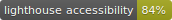
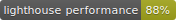
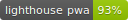

# @atscm/docs

> Sources of the page available at [atscm.github.io](https://atscm.github.io)

**Lighthouse performance:**

## Overview

This app is built with [Sapper](https://sapper.svelte.dev), displaying data extracted from [out main GitHub repositry](https://github.com/atSCM/atscm).

## Getting started

- First, make sure you have node (version >= 12) and npm (version >= 6) installed.
- Run `npm install` to install dependencies.
- Run `npm run fetch-data` to fetch data from GitHub.
- Run `npm run dev` to start the development server.
- Open [localhost:3000](http://localhost:3000) in the browser.

## Testing

Run `npm run test` to start the [Cypress](https://www.cypress.io) E2E tests. To see the tests as they get executed, run `npm run cy:open` first.
